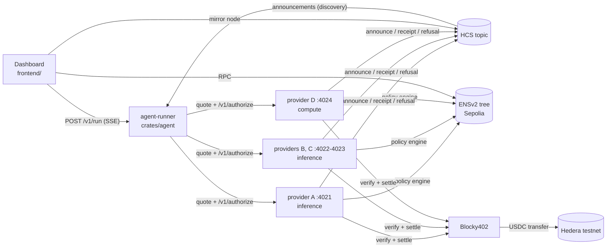
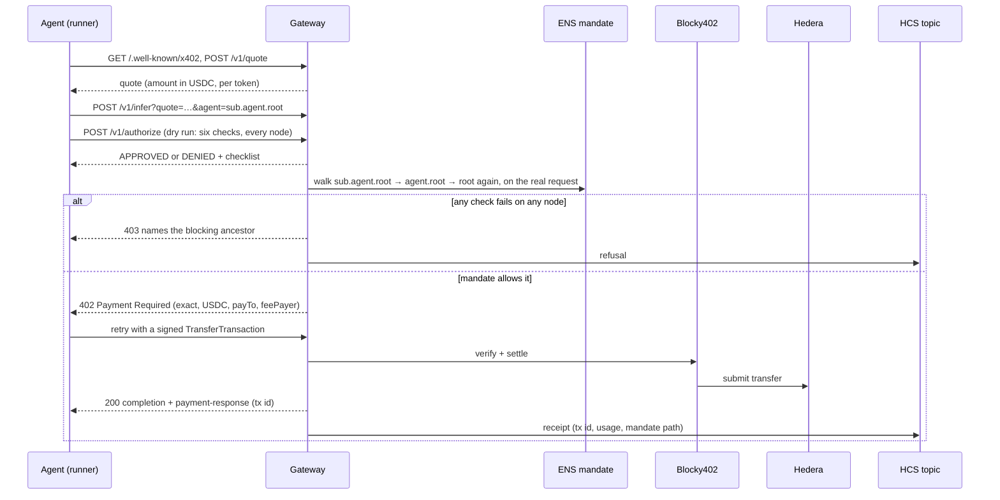

# Leash — agent spending authority as an ENSv2 namespace tree

Live on ENSv2 Sepolia and Hedera testnet. Each agent is a non-transferable, expiring subname whose
resolver text records are its budget. Agents mint sub-agents whose budgets and
expiries are enforced **on-chain as strict subsets** of their parent's. Every
payment settles on Hedera via x402, writes to HCS, and clears a middleware that
walks the whole ancestor chain first.

## Live on Sepolia (chain id 11155111)

| What | Address |
|---|---|
| L1 registry (holds `root`) | [`0x51d32dfa5baf7e3e1d718fdd37d0c346c5ba7838`](https://sepolia.etherscan.io/address/0x51d32dfa5baf7e3e1d718fdd37d0c346c5ba7838) |
| L2 registry (holds `agent`) | [`0xec8F768460DD212Fc83d47B048045EB6b6B13097`](https://sepolia.etherscan.io/address/0xec8F768460DD212Fc83d47B048045EB6b6B13097) |
| L3 registry (holds `sub`) | [`0x1189D5A05e60F7144b40b5F0FA144d1e2B695CF8`](https://sepolia.etherscan.io/address/0x1189D5A05e60F7144b40b5F0FA144d1e2B695CF8) |
| `MandateRegistrar` | [`0x33699c74f777c581db3b9c7079d87b778cae2312`](https://sepolia.etherscan.io/address/0x33699c74f777c581db3b9c7079d87b778cae2312) |
| Tree | `root` → `agent.root` → `sub.agent.root` (100000 / 50000 / 10000 budget, +90d / +60d / +30d) |

Verify without a wallet: `cast call $L3 'getResolver(string)(address)' sub`,
`cast call $L1 'getSubregistry(string)(address)' root`, or run the live test below.

## How it works

- **`contracts/src/MandateRegistrar.sol`** — `registerChild` enforces `child.budget ≤
  parent.budget` (live resolver text read) and `child.expiry ≤ parent.expiry` (live
  registry read), then mints with a bitmap that omits transfer roles. Parent bindings
  are owner-set once, so callers can never substitute a richer parent. 8/8 forge tests.
- **`contracts/script/DeployMandate.s.sol`** — one broadcast: 3 UserRegistry proxies +
  3 per-name resolver proxies via the Verifiable Factory, registrar auth, tree minting,
  hierarchy wiring (`setSubregistry`/`setParent`), record seeding, single-key ops delegation.
- **`crates/mandate`** — `MandateGuard` walks the ancestor chain fresh on every payment;
  `EnsResolver` walks down real `getSubregistry` pointers (no hardcoded levels) and maps
  expired-but-registered names to lapsed nodes so the guard reports *Expired*, not missing.
- **`crates/gateway`** — x402-gated inference; `MANDATE_MODE=mock` (seeded in-memory tree),
  `=ens` (this deployment), `=off`. HCS receipts + scheduled drip when Hedera keys set.

## Run it

```sh
cargo test --workspace          # all green (needs protoc for hedera-proto build)
cd contracts && forge test      # registrar unit tests

# Live tree check (needs any Sepolia RPC + the L1 address above):
LEASH_RPC_URL=... LEASH_TOP_REGISTRY=0x51d32...ba7838 LEASH_LEAF=sub.agent.root \
  cargo test -p mandate --test live_sepolia -- --ignored --nocapture
# expect: live chain ok: ["root", "agent.root", "sub.agent.root"]

# Gateway against the live tree:
MANDATE_MODE=ens SEPOLIA_RPC_URL=... MANDATE_REGISTRY_ADDRESS=0x51d32...ba7838 \
  cargo run -p gateway
```

Redeploy from scratch: fill `SEPOLIA_RPC_URL` + `DEPLOYER_KEY` (testnet only, never
commit) and follow `contracts/DEPLOY.md`.

## Hedera: x402-gated inference that agents pay for

A real service on Hedera testnet, sold per token over x402 and settled by the
**Blocky402** facilitator in **USDC (HTS `0.0.429274`)**. There are no API keys,
no accounts and no subscriptions: an agent discovers providers, prices its
prompt with each one, pays the cheapest, and gets served. Before a price is
ever named, the gateway checks the agent's ENS mandate and every parent above it.

| What | Value |
|---|---|
| Network | Hedera testnet (`hedera:testnet`), x402 v2 `exact` scheme |
| Facilitator | `https://api.testnet.blocky402.com`, which also pays the Hedera network fee |
| Settlement asset | USDC, HTS token [`0.0.429274`](https://hashscan.io/testnet/token/0.0.429274), 6 decimals |
| Provider payee | [`0.0.10492140`](https://hashscan.io/testnet/account/0.0.10492140) |
| Shared agent wallet (payer) | [`0.0.10499031`](https://hashscan.io/testnet/account/0.0.10499031) |
| Audit trail (HCS topic) | [`0.0.10494264`](https://hashscan.io/testnet/topic/0.0.10494264): every receipt and every refusal |

### Architecture



- **`crates/gateway`**: the paid service. `GET /.well-known/x402` is the
  manifest (discovery), `POST /v1/quote` prices a prompt, and `POST /v1/infer`
  is gated by the mandate guard and then the x402 layer. It publishes receipts
  and refusals to HCS. It serves an OpenAI-compatible upstream when
  `OPENAI_BASE_URL` is set, and a deterministic stub otherwise.
- **`crates/agent`**: the buyer. `agent` is the CLI; `agent-runner` is the same
  flow behind HTTP, streaming each step to the dashboard as server-sent events.
  Both hold the shared wallet key. The browser never sees it.
- **`crates/meter`**: per-token pricing. A quote is
  `input × per_1k_input + max_output × per_1k_output` (with a minimum), so two
  prompts cost two different amounts. The response reports tokens used and the
  output credit that was paid for but not consumed.
- **`frontend`**: the dashboard. **Run a paid request** drives the runner and
  shows every step live, then finds the run's own message on HCS.

### Payment flow



### Run the paid demo locally

```sh
# 1. Provider A: the main gateway (crates/gateway/.env: PAYMENT_ASSET=usdc,
#    MANDATE_MODE=ens, HCS keys; see .env.example)
cd crates/gateway && cargo run -p gateway

# 2. Providers B, C (inference) and D (compute): same binary, other names,
#    categories and prices. Each announces itself on HCS.
scripts/demo-providers.sh

# 3. The agent runner (crates/agent/.env: the shared wallet's key)
cd crates/agent && PROVIDERS=http://localhost:4021,http://localhost:4022,http://localhost:4023 \
  cargo run -p agent --bin agent-runner

# 4. The dashboard: Overview → "Run a paid request"
cd frontend && npm install && npm run dev
```

Or run one purchase from the terminal: `cd crates/agent && cargo run -p agent --bin agent`.
Both payer and payee must be associated with the USDC token first
(`cargo run -p agent --bin associate-token`).

### The policy engine

Leash decides; the agent only asks. Before any price is named, the gateway's
policy engine (`crates/mandate`, `MandateGuard::evaluate`) walks the agent's
ENS chain root to leaf and runs six deterministic checks against every node:

| Check | Rule |
|---|---|
| Agent active | The name resolves in the tree |
| Within authority | `budget` ≥ what the node's whole subtree has already spent + this payment. Spending is replayed from the HCS receipts, so it counts across every provider and survives restarts |
| Within per-request limit | amount ≤ `maxPerCall` |
| Service permitted | the provider's category (`SERVICE_CATEGORY`) is in `allowedServices` |
| Asset permitted | the payment asset is in `allowedAssets`, or, without that record, is the asset budgets are denominated in (`MANDATE_ASSET`, USDC) |
| Not expired or revoked | the node's ENS expiry is in the future |

`POST /v1/authorize` runs the same evaluation without paying or recording
anything; the dashboard's policy simulator and the agent's "Authorize" step
both use it. A refusal on `/v1/infer` returns the full checklist in its `403`
and is published to HCS. `ratePerMinute` is recorded but not enforced yet.
Known gap: two payments authorized at the same instant can both fit; each is
still capped by `maxPerCall`, and the next check sees both.

### Discovery

Every gateway announces itself on the HCS topic when it starts
(`leash.service.announce.v1`: provider, category, model, base URL, pricing).
The agent runner discovers providers by replaying the topic (plus any in
`PROVIDERS`), fetches each live manifest, keeps the ones selling the requested
category, quotes them, and asks each one's policy engine, cheapest first, until
one approves. `scripts/demo-providers.sh` starts three extra providers: B and C
sell inference at other prices, D sells compute, which no agent's policy allows.

## Demo (≤5 min), all from the dashboard

1. **Overview**: the tree, the shared wallet's USDC balance, the HCS trail.
2. **Give `sub.agent.root` an inference task**: four providers are discovered
   on the HCS registry, three quote per token, Leash approves the cheapest
   (every check ✓), the agent pays it over x402, Blocky402 settles USDC on
   Hedera, the result comes back, and the receipt is confirmed on HCS.
3. **Give it a compute task**: provider D quotes $0.008, Leash denies it
   (compute isn't in `allowedServices`, and it's over `maxPerCall`), nothing is
   signed. **Policies → simulator** shows the same decision without a task.
4. **Revoke `root`** (one `unregister` tx, no loop over children): the next run
   as `sub.agent.root` is blocked, naming `root`. Restore it.
5. **Activity**: the whole trail, replayed from HCS.

Budgets are the `budget/allowedServices/ratePerMinute/maxPerCall` text records.
